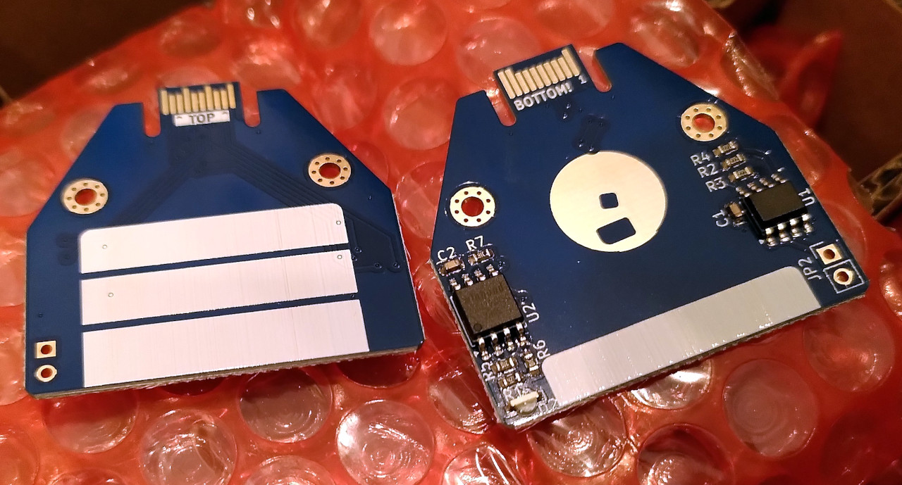

# Flopagon

A 16MB Flash storage solution for the [Tildagon](https://tildagon.badge.emfcamp.org/).  The Flopagon
is styled to look like a classic 3.5" floppy disk but it is functional as well.

## Hardware

### Schematic

There's a PDF of the [schematic](flopagon.pdf)

### Manufacturing files

The files I used to get the boards made and assembled by [JLC PCB](https://jlcpcb.com) are in the `manufacturing/version 1` folder.
The part numbers in the KiCad schematic reference parts from JLC/LCSC which can be used for their assembly service.

### Description

The Flopagon has two chips on it:

#### The EEPROM

There's a small (2kB) EEPROM in line with the [Hexpansion specification](https://tildagon.badge.emfcamp.org/hexpansions/creating-hexpansions/),
this is write protected by default and is designed to have an identity and a small helper app to get the Flopagon up and running.

To write the EEPROM you need to short the two pads of the unpopulated 0.1" header in the corner of the Flopagon.  You can do that easily with a
bit of wire, a pair of tweezers etc.

#### The Flash Memory

The second chip is a 16MB Flash chip, this connects via an SPI interface using the 4 high-speed I/O pins on the hexpansion interface.
This chip can be formatted with a filesystem and used for storing Python scripts or images, music, data files etc.

## Software

So far I've not managed to get the EEPROM working properly on this board.  There appear to be some issues in the main badge firmware which
is still being actively developed.  Hopefully I'll come up with a working EEPROM image at some point.

The app I had intended to put on the EEPROM is in the `app` folder.  It's a really simple app that presents a 3 option menu which lets you
mount, remove and format the Flash storage.  Take a look at the app to see how to set up SPI, use the Flash driver and FAT filesystem routines
which are all built in to the badge firmware.

Once the Flopagon is mounted by that app, it just shows up as `/flopagon` on the virtual filesystem of the badge.  Try running:

    import os
    os.listdir("/")

To see the folder.

You can read and write files in the `/flopagon` folder just like you would on a PC running Python, but once you've unmounted the flopagon
(either with the app, or by running `os.umount("/flopagon")`) the files disappear but are safely stored on the Flash device.

## Ideas I've had for using a flopagon

I think with the right code it should be possible to automatically start the Flash chip using a small program on the EEPROM.  From there
you could start launching code from the mounted filesystem so you could have a game that starts when you plug in the Flopagon, like a
cartridge.

Perhaps a file manager app for the badge is required?

Maybe you could put [Doom](https://github.com/espressif/esp32-doom) on a Flopagon?
