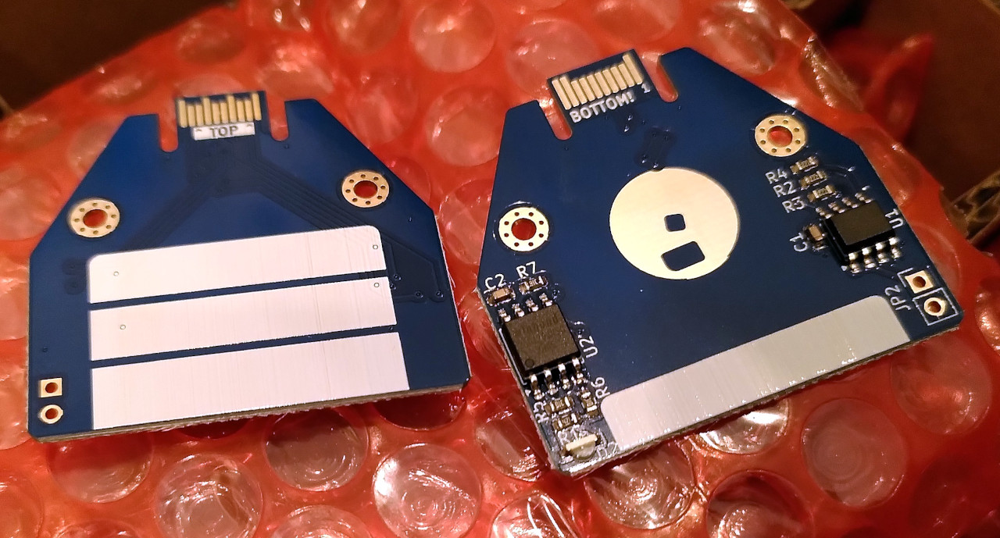

# Flopagon

A 16MB Flash storage solution for the [Tildagon](https://tildagon.badge.emfcamp.org/).  The Flopagon
is styled to look like a classic 3.5" floppy disk but it is functional as well.

## Hardware

### Schematic

There's a PDF of the [schematic](flopagon.pdf)

### Manufacturing files

The files I used to get the boards made and assembled by [JLC PCB](https://jlcpcb.com) are in the `manufacturing/version 1` folder.
The part numbers in the KiCad schematic reference parts from JLC/LCSC which can be used for their assembly service.

### Description

The Flopagon has two chips on it:

#### The EEPROM

There's a small (2kB) EEPROM in line with the [Hexpansion specification](https://tildagon.badge.emfcamp.org/hexpansions/creating-hexpansions/),
this is write protected by default and is designed to have an identity and a small helper app to get the Flopagon up and running.

To write the EEPROM you need to short the two pads of the unpopulated 0.1" header in the corner of the Flopagon.  You can do that easily with a
bit of wire, a pair of tweezers etc.

Flopagon V2 (you can tell it's a V2 because it's black not blue) has an 8kB EEPROM
for a bit of extra space.

#### The Flash Memory

The second chip is a 16MB Flash chip, this connects via an SPI interface using the 4 high-speed I/O pins on the hexpansion interface.
This chip can be formatted with a filesystem and used for storing Python scripts or images, music, data files etc.

## Software

The EEPROM on the Flopagon can be programmed with a simple app that lets you
mount/unmount and format the storage.  Source is in the `app` directory.  To squeeze
the code into the small EEPROM on the original Flopagon it needs to be compiled to
a `*.mpy` file, I've done this already but if you want to modify it you'll need to
do this step.  You need the [mpy-cross](https://pypi.org/project/mpy-cross/) tool
then you can simply run

    mpy-cross app.py

To setup a Flopagon you need to plug it in to your badge and connect to the badge using [mpremote]().  The Tildagon on-board Hexpansion manager will be able to do
this for you soon, but for development reasons you'll still need to follow the steps

On the host change into the `app` directory of a checkout of this repository and run:

    mpremote mount .

This will connect to the running micropython system on your badge, hit `Ctrl-C` to
interrupt the normal OS and get a Python prompt.

    from prepare_eeprom import setup_flopagon

(Obviously import setup_flopagon_v2 if you've got one of the new black ones.  The
only difference is the size of the EEPROM in the header)

Fit the flopagon into a port, they're numbered from 1 clockwise from the top/right 
port.  Short the write-protect jumper, I normally stuff a pair of tweezers in the 
holes.  Now run the command:

    setup_flopagon(2)

The port number needs to be passed, in this example I've used port 2 (right hand
side).  That should do all the formatting and mount and copy the app onto the EEPROM.

Reset the badge to get the hexpansion to do its thing.  It should pop up an app
that lets you mount or format the hexpansion.

## Ideas I've had for using a flopagon

I think with the right code it should be possible to automatically start the Flash chip using a small program on the EEPROM.  From there
you could start launching code from the mounted filesystem so you could have a game that starts when you plug in the Flopagon, like a
cartridge.

Perhaps a file manager app for the badge is required?

Maybe you could put [Doom](https://github.com/espressif/esp32-doom) on a Flopagon?
